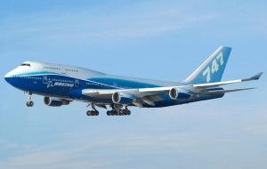
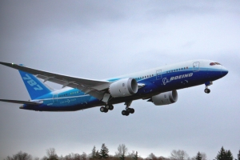
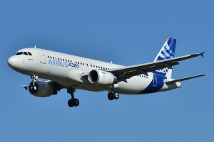

# JC's GitHub Page for CSE 110
## Myself as a Person
Born and raised in **Columbus, Ohio**. However, I did spend one year of preschool, elementary, and middle school in France. Hon, Hon, Oui, Oui Baugette.

This is a photo of Mont Blanc, the highest mountain in western Europe, that I took with my phone through binoculars during sunset this summer.


I'm currently a second-year Computer Science Major and planning on doing a Business Minor.

~~When I'm not questioning why I chose to be a Computer Science Major~~, I'm usually playing tennis, surfing, cooking, or playing Pokemon Go.

My top three favorite Pokemon

  
1. Ivysaur
2. Steelix
3. Rayquaza

Random Quote from Dublin Airport in Ireland I found entertaining
> Saying I ran a half marathon is better than saying I tried running a marathon and quit halfway

I'm also an aviation enthusiast and enjoy plane spotting commerical aircraft from time to time

[Flight Tracking Website](flightradar24.com)

Some of my favorite aircraft include:



- B747-400, the Iconic Queen of the Skies
- B787-800, it's hard to beat wing flex
- A320-200, an absolute workhorse, the winglets are *chef's kiss* 

Planes I want to fly on
 [x] B747-400
 [ ] B747-800
 [x] B787-8/9/10
 [ ] B777x
 [ ] A380-800
 [ ] A350-1000
 [ ] A340-400
 [x] A320neo
 [x] A321-200
 [x] A220-200/300

## Myself as a Programmer
My first CS Class was AP Computer Science A in 2018 where I learned Java. Since then I've taken at least one CS class every year. I've dabbled in Java, Python, C, C++.

I enjoy participating in hack-a-thons, capture the flags, or just coding for fun.
My friends and I would always compete under this name in any coding competition. Iykyk.
```
hips.setLie(false);
```
My main motivations for most of my side coding projects have been trying to avoid a paywall or trying to get something for free, for example I am currently making a chess opening app because I don't want to pay for a chess.com membership. I learned Python because I wanted to use it as a twitter bot that would like tweets from a certain esports team since they had a rewards program.